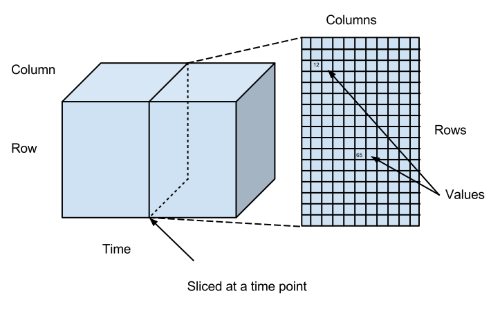

# Intro to Datasets

Datasets are schema-less, append-only named sets of *data points*, which are contained in *cells*, which sit at the intersection of *rows* and *columns*. Data points are composed of a *value* and a *timestamp*. Each data point can thus be represented as a (row, column, timestamp, value) tuple, and datasets can be thought of as sparse 3-dimensional matrices. The rows and columns of a dataset can be interchanged by transposing the matrix. Datasets can contain billions of data points arranged in millions of rows with millions of columns.

Rows and columns have structured identifiers, called *paths*. A path is an array of strings called *path elements* (e.g. `['a','b']`) and can be represented as strings called *names* with dots between the path elements (e.g. `'a.b'`). Dots can appear in path elements, causing their string representation to be surrounded by double-quote characters, which can themselves appear in path elements, and are doubled up in the string representation: the path `['a.b', '"hello"']` is stringified as `"a.b"."""hello"""`. These rules make it possible to manipulate hierarchically-structured (i.e. JSON) data within [SQL queries](../sql/Sql.md).

Datasets can be created and data can be appended to them via the [REST API](../WorkingWithRest.md) and they can also loaded from or saved to files via [Procedures](../procedures/Procedures.md).

## Matrix View

The following diagram shows this as a 3-dimensional matrix, and shows what
happens when we "slice" the matrix at a particular point in time.

Ignoring the time dimension, you can imagine that the data looks something like this:

<table cellpadding="0" cellspacing="0" class="c17"><tbody><tr class="c3"><td class="c5" colspan="1" rowspan="1">

</td><td class="c5" colspan="1" rowspan="1">
ColumnA
</td><td class="c5" colspan="1" rowspan="1">
ColumnB
</td><td class="c5" colspan="1" rowspan="1">
ColumnC
</td><td class="c5" colspan="1" rowspan="1">
ColumnD
</td><td class="c5" colspan="1" rowspan="1">
ColumnE
</td></tr><tr class="c3"><td class="c5" colspan="1" rowspan="1">
RowA
</td><td class="c5" colspan="1" rowspan="1">

</td><td class="c5" colspan="1" rowspan="1">

</td><td class="c5" colspan="1" rowspan="1">

</td><td class="c5" colspan="1" rowspan="1">

</td><td class="c5" colspan="1" rowspan="1">

</td></tr><tr class="c3"><td class="c5" colspan="1" rowspan="1">
RowB
</td><td class="c5" colspan="1" rowspan="1">
123
</td><td class="c5" colspan="1" rowspan="1">

</td><td class="c5" colspan="1" rowspan="1">
7634.2
</td><td class="c5" colspan="1" rowspan="1">

</td><td class="c5" colspan="1" rowspan="1">

</td></tr><tr class="c3"><td class="c5" colspan="1" rowspan="1">
RowC
</td><td class="c5" colspan="1" rowspan="1">

</td><td class="c5" colspan="1" rowspan="1">
&quot;hello&quot;
</td><td class="c5" colspan="1" rowspan="1">

</td><td class="c5" colspan="1" rowspan="1">

</td><td class="c5" colspan="1" rowspan="1">

</td></tr><tr class="c3"><td class="c5" colspan="1" rowspan="1">
RowD
</td><td class="c5" colspan="1" rowspan="1">

</td><td class="c5" colspan="1" rowspan="1">

</td><td class="c5" colspan="1" rowspan="1">

</td><td class="c5" colspan="1" rowspan="1">

</td><td class="c5" colspan="1" rowspan="1">

</td></tr><tr class="c3"><td class="c5" colspan="1" rowspan="1">
RowE
</td><td class="c5" colspan="1" rowspan="1">

</td><td class="c5" colspan="1" rowspan="1">

</td><td class="c5" colspan="1" rowspan="1">

</td><td class="c5" colspan="1" rowspan="1">

</td><td class="c5" colspan="1" rowspan="1">

</td></tr></tbody></table>

## Events View

Another way of looking at the data is as a series of events, as follows:

<table cellpadding="0" cellspacing="0" class="c17"><tbody><tr class="c3"><td class="c4" colspan="1" rowspan="1">
Timestamp
</td><td class="c4" colspan="1" rowspan="1">
Row Name
</td><td class="c4" colspan="1" rowspan="1">
Column Name
</td><td class="c4" colspan="1" rowspan="1">
Value
</td></tr><tr class="c3"><td class="c4" colspan="1" rowspan="1">
2013-04-20 10:02:01
</td><td class="c4" colspan="1" rowspan="1">
User123
</td><td class="c4" colspan="1" rowspan="1">
First Name
</td><td class="c4" colspan="1" rowspan="1">
&quot;Bob&quot;
</td></tr><tr class="c3"><td class="c4" colspan="1" rowspan="1">
2013-04-20 10:02:01
</td><td class="c4" colspan="1" rowspan="1">
User123
</td><td class="c4" colspan="1" rowspan="1">
Test Score 1
</td><td class="c4" colspan="1" rowspan="1">
0.78
</td></tr><tr class="c3"><td class="c4" colspan="1" rowspan="1">
2013-04-20 10:03:33
</td><td class="c4" colspan="1" rowspan="1">
User456
</td><td class="c4" colspan="1" rowspan="1">
First Name
</td><td class="c4" colspan="1" rowspan="1">
&quot;Jill&quot;
</td></tr><tr class="c3"><td class="c4" colspan="1" rowspan="1">
2013-04-20 10:03:33
</td><td class="c4" colspan="1" rowspan="1">
User456
</td><td class="c4" colspan="1" rowspan="1">
Test Score 1
</td><td class="c4" colspan="1" rowspan="1">
0.45
</td></tr><tr class="c3"><td class="c4" colspan="1" rowspan="1">
2013-04-22 11:10:22
</td><td class="c4" colspan="1" rowspan="1">
User123
</td><td class="c4" colspan="1" rowspan="1">
Test Score 1
</td><td class="c4" colspan="1" rowspan="1">
0.0
</td></tr><tr class="c3"><td class="c4" colspan="1" rowspan="1">
2013-04-22 11:10:22
</td><td class="c4" colspan="1" rowspan="1">
User123
</td><td class="c4" colspan="1" rowspan="1">
Revision Reason
</td><td class="c4" colspan="1" rowspan="1">
&quot;Cheating&quot;
</td></tr><tr class="c3"><td class="c4" colspan="1" rowspan="1">
...
</td><td class="c4" colspan="1" rowspan="1">
...
</td><td class="c4" colspan="1" rowspan="1">
...
</td><td class="c4" colspan="1" rowspan="1">
...
</td></tr></tbody></table>

The ability to record multiple states of the world at different times
is a fundamental part of the design of MLDB as a database for machine
learning.  The two versions of
Bob's score are both recorded, along with the time at which it changed.
This allows MLDB to reconstruct what was known at a given point in time,
making historical data far more useful to learn from.

## Available Dataset Types

Datasets are created via a [REST API call](DatasetConfig.md) with one of the following types:

## See also

- [Query API reference] (../sql/QueryAPI.md)
*  
*  
